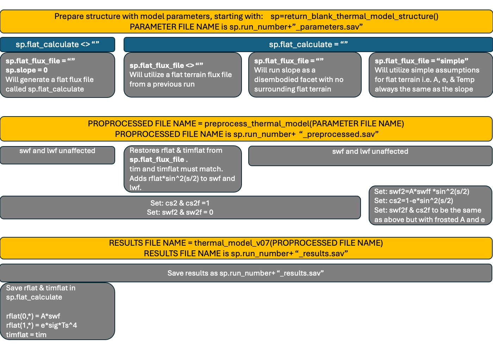

## Thermal model description

This project utilizes a 1D thermal diffusion model to simulate temperature at the surface and at depth. The model supports multiple solar system bodies (incl. user defined orbital elements), changes in thermophysical properties with depth, and arbitrary terrain slope and aspect.  In the case of Mars, atmospheric pressure varies seasonally and user-defined elevation is used to calculate the seasonally varying CO2 frost point.

Slopes receive energy from the sky (both direct and diffusely scattered) and the surrounding terrain. In this model we assume the surrounding terrain is an infinite flat plain that has Lambert scattering properties. As this is a 1D model, sloping surfaces need two model runs. First a model for flat terrain is run, which creates two results files:
1. The results for the flat surface: temperature, CO2 frost mass etc...
2. The upwelling flux from the flat surface (if requested).
This second output file can then be utilized in the next thermal model run for a sloping surface.  Upwelling reflected visible flux and emitted thermal flux is added to the direct and atmospheric flux 

There are a few steps to running the model for either sloping or flat terrain.  Firstly, the model parameters are chosen and stored in an IDL structure. This is easiest to start by returning a structure with all the necessary fields defined that can be updated using the `return_blank_thermal_model` function with no arguments. Secondly, this structure is passed to a function called `preprocess_thermal_model`, which calculates all the incident radiation and the vertical position of all subsurface layers and their properties. This function saves a file with these quantities (using the IDL save format), which is ready to use as input to the thermal model itself and returns the filename.  Finally, the name of this file is passed to the thermal model function `thermal_model_v07`.  The thermal model is agnostic to the body being simulated and just implements the output of the preprocess_thermal_model function. The thermal model function saves a results file (again with IDL save file format) and returns the filename of the results file. 

If running the thermal model on its own, the assumptions about atmospheric radiation are simplistic and conventional (e.g. scattered radiation is a fixed proportion of the direct beam and atmospheric thermal emission is a fixed proportion of the noon-time direct beam - these proportions are configurable in the parameters structure). The workflow can be summarized in the figure below. To integrate the radiative transfer solutions of DISORT the user intervenes after the preprocessing step and before the thermal model run in a procedure described below.

 

## Combining MCD, DISORT, and the IDL thermal model
The IDL thermal model provides the solar azimuth/zenith angle and, for the flat surface, the temperature and albedo/emissivity (which changes seasonally as CO2 frost comes and goes).  Using these values we can interpolate from the two lookup tables described at the end of the Radiative transfer section to get the flux incident on the sloping facet.  

Getting this thermal solution for the flat facet is problematic as we don't know the temperatures and albedo/emissivity apriori and those quantities affect the radiation incident on the flat terrain. We iterate to converge on the correct answer.  Fluxes on the flat terrain are first calculated with some simple atmospheric assumptions, the resulting temperatures and frost behavior are used to update the thermal/visible fluxes and the temperature simulation run again etc... Typically iterating 4-5 times is enough to have temperatures repeat to within a fraction of a degree at all times of year.

Once a self-consistent thermal solution for the flat terrain is known, then that information can be used in the radiative transfer lookup tables to find the fluxes on the sloping surface. No iteration is required on this step as, although the flat surface behavior affects the slope, the slopes temperatures has no effect on the surrounding flat surface.

## Filename conventions
The model parameter structure (`sp`) has a field called (`sp.run_number`) that will be applied to exported files at various steps.  It's useful to give this string an informative name 

